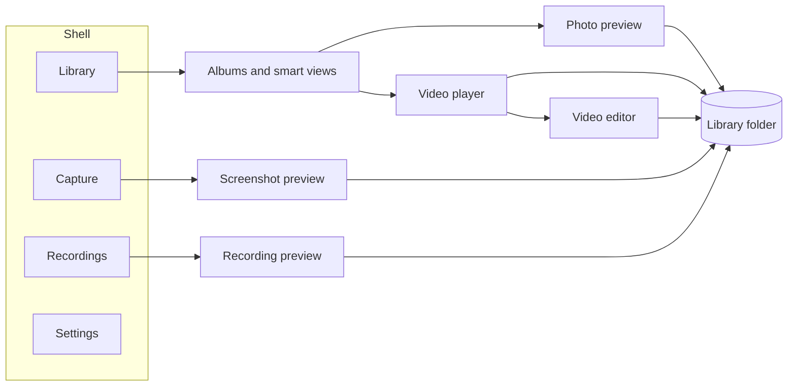

<div align="center">

# Personal Media Player

A Windows desktop library for photos, videos, screenshots, and screen recordings.  
Files stay on this PC. Albums are JSON lists. There is no database.

[](#requirements)
[](#requirements)
[](#requirements)
[](docs/guide.md)
[](docs/architecture.md)

</div>

---

## Start here

Install the [.NET 10 SDK](https://dotnet.microsoft.com/download), then from this folder:

```powershell
dotnet run --project src/PersonalMediaPlayer.App/PersonalMediaPlayer.App.csproj -c Debug -p:Platform=x64
```

Visual Studio 2022 can open `PersonalMediaPlayer.slnx` and start **PersonalMediaPlayer.App**.

The first launch creates the library at `%LocalAppData%\PersonalMediaPlayer\Library`. Settings has a button that opens that folder.

## The window



| Area | What you do there |
| --- | --- |
| **Library** | Import, search, album, favorite, slideshow, and find duplicate files |
| **Photos** | Draw, blur, crop, rotate, compare with the original, and read a selected area |
| **Videos** | Play, hover the timeline for a frame, bookmark, resume, trim, edit, and grab a still |
| **Capture** | Shoot an area, window, monitor, every display, or turn a text file into an image |
| **Recordings** | Record a monitor, a window, or a rectangle, with optional speaker audio |
| **Settings** | Theme, library folder, screenshot delay, cursor, and the shortcut list |

Details for each screen are in the [user guide](docs/guide.md).

## Library at a glance

Import or drop files. Photos: `png` `jpg` `jpeg` `webp` `bmp` `gif`. Videos: `mp4` `mkv` `mov` `avi` `wmv` `webm` `m4v`.

| View | Contents |
| --- | --- |
| All media | Every file the app owns |
| Photos / Videos | Split by type, including screenshots and recordings |
| This month | Imported during the current calendar month |
| Favorites | Heart on the thumbnail. The heart shows while the pointer is over the card |
| Unfiled | Not in an album you created |
| Duplicates | Same bytes, even when the names differ |
| Screenshots / Recordings | Saved captures and saved takes |
| Your albums | Membership only. The file stays in one place on disk |
| Recently deleted | Restorable for 7 days |

**Add to** keeps the current album. **Move to** leaves it. Deleting from a smart view or from All media removes the file. Deleting from an album you created only drops that membership. Deleting a favorite only clears the heart.

Search covers the name, the type, the album, and words read from a screenshot. A text hit opens with the matching words boxed on the preview. The saved image is unchanged.

## Picture, player, capture

<div align="center">

| Photo | Video | Capture and recording |
| --- | --- | --- |
| Pen, arrow, rectangle, text, blur, crop | Shared control bar on the picture | Area, window, monitor, all displays, fullscreen |
| Read the whole shot, or only the box you drag | Hover shows a frame and a time. Click or drag seeks | Text file drawn as one tall image |
| Slider compares the original and the saved file | Bookmarks, resume, replay, and an editor for speed, volume, trim, and cuts | Speaker audio on a recording. No microphone |
| Restore puts the backup back | Still frame of the current moment | Shortcuts work while the app is in the background |

</div>

Leaving a screenshot, a marked photo, a trimmed video, an open video edit, or an unsaved recording asks you to stay or leave before the page changes.

## Screenshot shortcuts

These do not replace Print Screen.

| Shortcut | Captures |
| --- | --- |
| `Ctrl` `Alt` `Shift` `A` | Selected area |
| `Ctrl` `Alt` `Shift` `W` | Single window |
| `Ctrl` `Alt` `Shift` `M` | Single monitor |
| `Ctrl` `Alt` `Shift` `D` | All monitors |
| `Ctrl` `Alt` `Shift` `F` | Display under the pointer |

Delay is 0, 3, 5, or 10 seconds. OCR uses the Windows language packs you have installed.

## Requirements

| Piece | Used for |
| --- | --- |
| Windows 10 version 1809 or later, or Windows 11 | The app itself |
| [.NET 10 SDK](https://dotnet.microsoft.com/download) | Build and `dotnet run` |
| A display | Graphics Capture for screenshots and recording |
| Windows OCR language pack | Screenshot search and reading text. Optional |

The build is an unpackaged WinUI 3 executable. Developer Mode is not required.

## Read next

| Document | What it covers |
| --- | --- |
| [docs/guide.md](docs/guide.md) | How each page behaves |
| [docs/architecture.md](docs/architecture.md) | Projects, folders on disk, and the Windows APIs behind the features |

```powershell
dotnet build src/PersonalMediaPlayer.App/PersonalMediaPlayer.App.csproj -c Debug -p:Platform=x64
```
