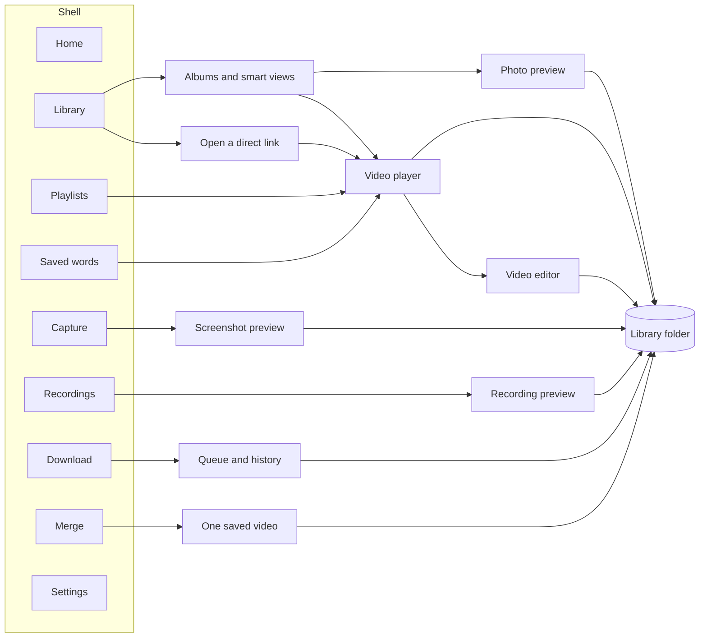

<div align="center">

# Personal Media Player

A Windows desktop library for photos, videos, screenshots, and screen recordings.  
Files stay on this PC. Albums are JSON lists. There is no database.

[](#requirements)
[](#requirements)
[](#requirements)
[](docs/guide.md)
[](docs/architecture.md)

</div>

---

## Start here

Install the [.NET 10 SDK](https://dotnet.microsoft.com/download), then from this folder:

```powershell
dotnet run --project src/PersonalMediaPlayer.App/PersonalMediaPlayer.App.csproj -c Debug -p:Platform=x64
```

Visual Studio 2022 can open `PersonalMediaPlayer.slnx` and start **PersonalMediaPlayer.App**.

The first launch creates the library at `%LocalAppData%\PersonalMediaPlayer\Library`. Settings has a button that opens that folder.

## The window


```mermaid
flowchart LR
  subgraph shell [Shell]
    direction TB
    Home
    Library
    Playlists
    Words[Saved words]
    Recordings
    Download
    Merge
    Capture
    Settings
  end

  Library --> Views[Albums and smart views]
  Library --> Link[Open a direct link]
  Views --> Photo[Photo preview]
  Views --> Player[Video player]
  Link --> Player
  Playlists --> Player
  Words --> Player
  Player --> Editor[Video editor]
  Capture --> Shot[Screenshot preview]
  Recordings --> Take[Recording preview]
  Download --> Queue[Queue and history]
  Merge --> Joined[One saved video]
  Photo --> Folder[(Library folder)]
  Player --> Folder
  Editor --> Folder
  Shot --> Folder
  Take --> Folder
  Queue --> Folder
  Joined --> Folder
```

| Area | What you do there |
| --- | --- |
| **Home** | Search library files and online playlist videos from one box. A result shows a thumbnail, the name, and Video or Photo. A library file keeps the Library label, and a local video also lists its playlists. The same video is listed once. Play next puts a video result first in the queue, and Add to queue adds it at the end. The current video keeps playing. Coming back keeps the search text, the results, and the scroll position until the app closes. Library, Playlists, and Saved words keep their searches the same way. Continue a video, play a playlist from its cover or open that list, hover the cover to preview the videos, open a recent file or saved word, and see a download. All opens the full list |
| **Library** | Import, connect a folder on this PC, search, album, favorite, slideshow, open a direct link, and find duplicate files. Refresh and opening the app find new photos and videos in a connected folder. Disconnect leaves those files on the PC and in the library. Play next puts videos that are on this PC first in the queue, and Add to queue adds them at the end. Coming back keeps the search and the open album until the app closes |
| **Playlists** | Collect library videos and online videos and play them in order. Search filters the list. Drag, move, or sort, and the order is saved. Undo puts the last of those changes back. A video is marked watched when it ends, or from a right-click, and that mark is saved. Unwatched only hides watched videos. The player panel can reorder that list without restarting the video. Shuffle plays each video once in a random order. Repeat can replay one video or the playlist. The saved order stays as it is. Play next puts a row first in the queue, and Add to queue adds it at the end. Next uses that queue before shuffle and repeat. Dragging the queue does not change the saved playlist. Closing it leaves a small card on the video. Opening a video outside that playlist hides the card and the Playlist button |
| **Saved words** | Open a caption word you saved, at that moment, with the audio and captions from then. **Words** on the player shows that list and hides it again |
| **Photos** | Draw, blur, crop, rotate, compare with the original, and read a selected area |
| **Videos** | Play a file or a stream, hover the timeline for a frame, bookmark, resume, trim, edit, grab a still, and save caption words with a Turkish meaning. Leaving the player keeps it going in a small player at the bottom right, with its own timeline. The full player and the small player share a volume. A download preview keeps its own. A download, editor, merge, or recording preview pauses the other video. The queue sits beside the player. Play next puts a video first, Add to queue adds it at the end, and a drag changes that order. Clear removes the waiting videos, and Undo puts the last clear or removal back in the same order. The current video keeps playing. The queue is cleared when the app closes. Chapters from the file or the page are listed beside the player when that video has them. Chapters shows or hides that list until the app closes, and a video with no chapters hides the button. Bookmarks stay as they are |
| **Merge** | Order clips, trim and fade each one, preview the sequence, and save one video. The first caption track comes along |
| **Capture** | Shoot an area, window, monitor, every display, or turn a text file into an image |
| **Recordings** | Record a monitor, a window, or a rectangle, with optional speaker audio |
| **Download** | Queue a YouTube video or the playlist episodes you check, choose an uploaded subtitle or an automatic caption, preview, then save into the library or any PC folder. Finished downloads can be selected and saved into one folder. The app asks before replacing a file that is already there |
| **Settings** | Theme, library folder, screenshot delay, cursor, online audio and subtitles, and the shortcut list. Export backup and Restore backup copy the saved data, not the media files. Restore checks the records, asks first, and keeps the previous copy |

Details for each screen are in the [user guide](docs/guide.md).

## Library at a glance

Import or drop files, then choose **Copy** or **Use where it is**. Photos: `png` `jpg` `jpeg` `webp` `bmp` `gif`. Videos: `mp4` `mkv` `mov` `avi` `wmv` `webm` `m4v` `m4a`. A linked file stays in its folder. Removing it from the library does not delete it. **Connect folder** watches a folder on this PC for photos and videos the library already accepts. Refresh and opening the app look again. The files stay in that folder, and the same path is listed once. Disconnect leaves the files on the PC and in the library. **Locate** accepts another file of the same type and keeps saved words, bookmarks, and the playback position. A photo cannot replace a video. Ctrl+click, Shift+click, and Ctrl+A select files in the current view. The selection bar adds those videos to a playlist and adds or removes favorites together.

| View | Contents |
| --- | --- |
| All media | Every copied or linked file |
| Photos / Videos | Split by type, including screenshots and recordings |
| This month | Imported during the current calendar month |
| Favorites | Heart on the thumbnail. The heart shows while the pointer is over the card |
| Unfiled | Not in an album you created |
| Duplicates | Same bytes, even when the names differ |
| Screenshots / Recordings | Saved captures and saved takes |
| Your albums | Membership only. The file stays in one place on disk |
| Recently deleted | Restorable for 7 days |

**Add to** keeps the current album. **Move to** leaves it. Deleting from a smart view or from All media removes the file. Deleting from an album you created only drops that membership. Deleting a favorite only clears the heart.

Search covers the name, the type, the album, and words read from a screenshot. A text hit opens with the matching words boxed on the preview. The saved image is unchanged.

## Picture, player, capture

<div align="center">

| Photo | Video | Capture and recording |
| --- | --- | --- |
| Pen, arrow, rectangle, text, blur, crop | Shared control bar on the picture | Area, window, monitor, all displays, fullscreen |
| Read the whole shot, or only the box you drag | Hover shows a frame and a time. Click or drag seeks | Text file drawn as one tall image |
| Slider compares the original and the saved file | Bookmarks, resume, replay, captions with hover meanings, playback settings for quality, audio, and a repeated section, and an editor for speed, sound, rotate, fade, crop, trim, and cuts | Speaker audio on a recording. No microphone |
| Restore puts the backup back | Still frame of the current moment | Shortcuts work while the app is in the background |

</div>

Leaving a screenshot, a marked photo, a trimmed video, an open video edit, an unsaved recording, or an unsaved merge asks you to stay or leave before the page changes. Closing the window with X asks the same question when that work is still open. A download keeps running when you leave Download. Closing the app pauses it and keeps the partial file.

**Open link** on Library plays a direct video address and leaves the library unchanged. The unpacked extension in `extension/` can send a page video, or a page such as YouTube, into that same player. **Save a copy** starts the download and leaves the stream playing. A video that needs a license stays in the browser. Load the extension unpacked in Chrome or Edge. The app build does not include it.

## Screenshot shortcuts

These do not replace Print Screen.

| Shortcut | Captures |
| --- | --- |
| `Ctrl` `Alt` `Shift` `A` | Selected area |
| `Ctrl` `Alt` `Shift` `W` | Single window |
| `Ctrl` `Alt` `Shift` `M` | Single monitor |
| `Ctrl` `Alt` `Shift` `D` | All monitors |
| `Ctrl` `Alt` `Shift` `F` | Display under the pointer |

Delay is 0, 3, 5, or 10 seconds. OCR uses the Windows language packs you have installed.

## Requirements

| Piece | Used for |
| --- | --- |
| Windows 10 version 1809 or later, or Windows 11 | The app itself |
| [.NET 10 SDK](https://dotnet.microsoft.com/download) | Build and `dotnet run` |
| A display | Graphics Capture for screenshots and recording |
| Windows OCR language pack | Screenshot search and reading text. Optional |

The build is an unpackaged WinUI 3 executable. Developer Mode is not required.

## Read next

| Document | What it covers |
| --- | --- |
| [docs/guide.md](docs/guide.md) | How each page behaves |
| [docs/architecture.md](docs/architecture.md) | Projects, folders on disk, and the Windows APIs behind the features |

```powershell
dotnet build src/PersonalMediaPlayer.App/PersonalMediaPlayer.App.csproj -c Debug -p:Platform=x64
```
